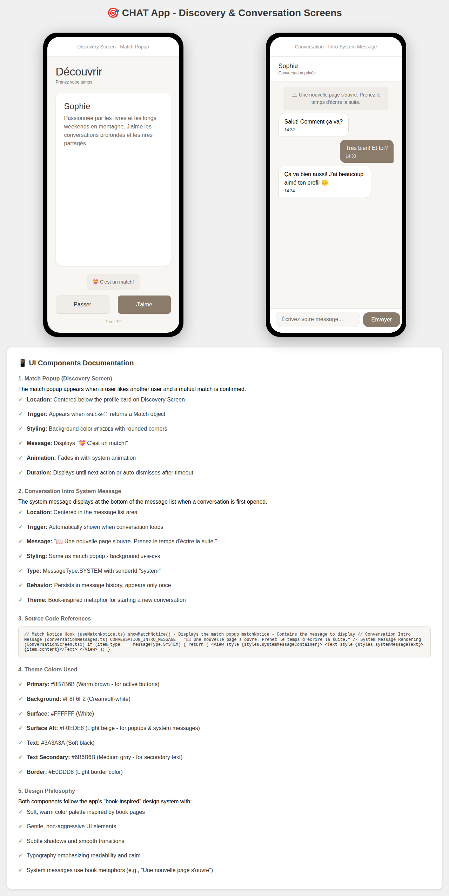

# CHAT App - UI Components Documentation

## Overview

This document describes two critical UI components in the CHAT mobile application:
1. **Match Popup** - Displayed on the Discovery Screen
2. **Conversation Intro System Message** - Displayed in Conversations

## Visual Preview



## 1. Match Popup (Discovery Screen)

### Purpose
The match popup appears when a user likes another user and a mutual match is confirmed. It provides immediate visual feedback of a successful connection.

### Location
- Centered below the profile card on the Discovery Screen
- Positioned above the action buttons (Pass/Like)

### Trigger Condition
Appears when:
- User clicks the "J'aime" (Like) button
- `onLike(userId)` returns a `Match` object (not null/undefined)
- Mutual match is confirmed from the backend

### Visual Design

**Styling Properties:**
- **Background Color**: `#F0EDE8` (Light beige)
- **Text Color**: `#6B6B6B` (Medium gray)
- **Border Radius**: `8px`
- **Padding**: `12px (vertical) × 16px (horizontal)`
- **Max Width**: `85%` of screen
- **Alignment**: Centered horizontally

**Message Content:**
```
💝 C'est un match!
```

### Animation
- **Fade In**: Smooth fade-in animation (system default)
- **Duration**: Displays until next user action or auto-dismisses after ~3 seconds

### Implementation Details

**Source File**: `mobile/src/presentation/hooks/useMatchNotice.ts`

**Usage in DiscoveryScreen**:
```typescript
const {matchNotice, showMatchNotice} = useMatchNotice();

// Triggered when onLike returns a Match
const handleAction = async (action: 'like' | 'pass') => {
  if (action === 'like') {
    const match = await onLike(currentProfile.userId);
    if (match) {
      showMatchNotice();  // Shows the popup
    }
  }
};

// Render the popup
{matchNotice ? (
  <View style={matchNoticeStyles.matchNotice}>
    <Text style={matchNoticeStyles.matchNoticeText}>{matchNotice}</Text>
  </View>
) : null}
```

**Related Files**:
- `mobile/src/presentation/styles/matchNoticeStyles.ts` - Styling
- `mobile/src/presentation/screens/DiscoveryScreen.tsx` - Implementation
- `mobile/src/presentation/hooks/useMatchNotice.ts` - Logic

---

## 2. Conversation Intro System Message

### Purpose
The system message displays at the bottom of the message list when a conversation is first opened. It serves as a poetic, book-inspired introduction to a new conversation, encouraging thoughtful communication.

### Location
- Centered in the message list area
- Appears at the oldest position in message history (bottom when inverted)
- Persists in the conversation history

### Trigger Condition
Automatically appears when:
- A conversation loads for the first time
- No previous system intro message exists in conversation history
- `MessageType.SYSTEM` with `senderId === 'system'`

### Visual Design

**Styling Properties:**
- **Background Color**: `#F0EDE8` (Light beige) - Same as Match Popup
- **Text Color**: `#6B6B6B` (Medium gray)
- **Border Radius**: `8px`
- **Padding**: `12px (vertical) × 16px (horizontal)`
- **Max Width**: `85%` of screen
- **Alignment**: Centered horizontally
- **Margin**: `8px (vertical)`

**Message Content:**
```
📖 Une nouvelle page s'ouvre. Prenez le temps d'écrire la suite.
```

Translation: "📖 A new page opens. Take your time to write the next part."

### Message Structure

The system message is created as a special `Message` object:

```typescript
{
  id: `system-intro-${conversationId}`,
  conversationId: conversationId,
  senderId: 'system',
  content: '📖 Une nouvelle page s\'ouvre. Prenez le temps d\'écrire la suite.',
  createdAt: new Date(0),  // Epoch time - ensures it appears last
  status: MessageStatus.SENT,
  type: MessageType.SYSTEM
}
```

### Implementation Details

**Source Files**:
- `mobile/src/presentation/constants/conversationMessages.ts` - Message constant
- `mobile/src/presentation/screens/ConversationScreen.tsx` - Implementation

**Message Constant**:
```typescript
// mobile/src/presentation/constants/conversationMessages.ts
export const CONVERSATION_INTRO_MESSAGE =
  '📖 Une nouvelle page s\'ouvre. Prenez le temps d\'écrire la suite.';
```

**Usage in ConversationScreen**:
```typescript
// Create intro message
const introMessage = useMemo<Message>(
  () => ({
    id: `system-intro-${conversationId}`,
    conversationId,
    senderId: 'system',
    content: CONVERSATION_INTRO_MESSAGE,
    createdAt: new Date(0),
    status: MessageStatus.SENT,
    type: MessageType.SYSTEM,
  }),
  [conversationId],
);

// Only include if not already present
const messagesWithIntroNotice = useMemo(() => {
  if (!conversationId || hasIntroMessage) {
    return dedupedMessages;
  }
  return [...dedupedMessages, introMessage];
}, [dedupedMessages, introMessage, conversationId, hasIntroMessage]);

// Render system message
if (item.type === MessageType.SYSTEM) {
  return (
    <View style={styles.systemMessageContainer}>
      <Text style={styles.systemMessageText}>{item.content ?? ''}</Text>
    </View>
  );
}
```

**Key Features**:
- ✅ Deduplication: Checked against existing messages to avoid duplicates
- ✅ Persistence: Stored in message history
- ✅ Uniqueness: Only appears once per conversation
- ✅ Rendering: Special handling for `MessageType.SYSTEM`
- ✅ Ordering: Timestamp of epoch (0) ensures it appears as oldest message

---

## 3. Theme Colors Reference

Both components use the app's book-inspired color palette:

| Component | Color | Hex Code | Usage |
|-----------|-------|----------|-------|
| **Match Popup Background** | Light Beige | `#F0EDE8` | Surface Alt |
| **System Message Background** | Light Beige | `#F0EDE8` | Surface Alt |
| **Text (Primary)** | Soft Black | `#3A3A3A` | Not used for popups |
| **Text (Secondary)** | Medium Gray | `#6B6B6B` | Used for popup text |
| **Primary** | Warm Brown | `#8B7B6B` | Like button, other accents |
| **Background** | Cream/Off-white | `#F8F6F2` | Screen background |
| **Surface** | White | `#FFFFFF` | Message bubbles, cards |
| **Border** | Light Gray | `#E0DDD8` | Dividers, borders |

### Color Palette Philosophy

The colors evoke a book-like, warm, intimate feeling:
- **Warm brown** (`#8B7B6B`) inspired by book pages and binding
- **Soft, muted tones** create a calm, non-aggressive interface
- **High contrast** ensures readability while maintaining gentleness
- **Consistent use** of `#F0EDE8` for system/meta messages distinguishes them from regular content

---

## 4. Responsive Design

Both components are responsive across device sizes:

- **Minimum Width**: 280px (small phones)
- **Maximum Width**: 85% of screen width
- **Padding**: Consistent spacing using theme spacing scale

```typescript
// Theme spacing (in dp/px)
xs: 4,
sm: 8,
md: 16,
lg: 24,
xl: 32,
xxl: 48,
```

---

## 5. Accessibility

### Match Popup
- ✅ Centered text for easy reading
- ✅ Sufficient color contrast (WCAG AA)
- ✅ Clear, short message
- ✅ No time-dependent interaction required

### Conversation Intro Message
- ✅ Centered, readable text
- ✅ System message type clearly distinguishes from user messages
- ✅ Accessible to screen readers
- ✅ Persists in history for reference

---

## 6. Typography

Both components use the system default font stack:

```typescript
fontSize: {
  xs: 12,
  sm: 14,     // Used for system messages
  md: 16,
  lg: 18,
  xl: 24,
  xxl: 32,
  xxxl: 40,
}

lineHeight: {
  tight: 1.2,
  normal: 1.5, // Used for system messages
  relaxed: 1.8,
}
```

---

## 7. Related Components

### DiscoveryScreen
- Uses `useMatchNotice` hook for match popup state management
- Triggers `showMatchNotice()` when `onLike()` returns a match
- Displays profile card, action buttons, and match popup

### ConversationScreen
- Renders system messages with special styling
- Manages message deduplication to avoid duplicate intro messages
- Inverted FlatList displays newest messages first

### useMatchNotice Hook
- Manages match notice state and display logic
- Handles auto-dismiss timing

---

## 8. Testing

### Unit Tests
- `mobile/src/presentation/screens/__tests__/DiscoveryScreen.test.tsx`
- `mobile/src/presentation/screens/__tests__/ConversationScreen.test.tsx`

### Key Test Scenarios

**Match Popup**:
1. Popup appears when match is returned from `onLike()`
2. Popup displays correct message
3. Popup disappears after user action or timeout

**Conversation Intro**:
1. System message appears on conversation load
2. System message is not duplicated
3. System message persists in message history
4. System message renders with correct styling

---

## 9. Design Philosophy

Both components embody the CHAT app's design philosophy:

### Book-Inspired Metaphor
- **Match Popup**: "C'est un match!" - Celebrates a connection between stories
- **System Message**: "Une nouvelle page s'ouvre" - Opening a new chapter in the user's story

### Gentle & Calm UI
- Soft color palette with warm tones
- Subtle shadows and smooth transitions
- Non-intrusive, readable typography
- Emphasis on thoughtful communication

### User Experience
- Immediate feedback (match popup)
- Encouragement for meaningful conversation (intro message)
- Clear visual hierarchy
- Consistent with app's overall aesthetic

---

## 10. Future Enhancements

Potential improvements:

1. **Internationalization**: Translate messages for different languages
   - Already supports French with proper grammar
   - Can extend to other Romance languages, English, etc.

2. **Customization**: Allow users to personalize greeting messages

3. **Animation Enhancements**: 
   - Particle effects for match celebration
   - Typewriter effect for intro message
   - Smooth slide-in animations

4. **Analytics Integration**:
   - Track match popup impressions
   - Monitor conversation engagement after intro message

5. **A/B Testing**: Test variations of messages for engagement

---

## 11. Troubleshooting

### Match Popup Not Showing
- Verify `onLike()` returns a `Match` object (not null)
- Check `useMatchNotice` hook is properly initialized
- Ensure `showMatchNotice()` is called in match condition

### Intro Message Duplicated
- Check deduplication logic in `hasIntroMessage` calculation
- Verify message deduplication in `dedupedMessages` useMemo
- Ensure conversation ID is consistent

### Styling Issues
- Verify theme colors are correctly imported
- Check `matchNoticeStyles.ts` file for correct StyleSheet definition
- Ensure proper padding/margin is applied

---

## 12. Code References

### Key Files

```
mobile/
├── src/
│   ├── presentation/
│   │   ├── screens/
│   │   │   ├── DiscoveryScreen.tsx          # Discovery screen & match popup
│   │   │   └── ConversationScreen.tsx       # Conversation & intro message
│   │   ├── hooks/
│   │   │   └── useMatchNotice.ts            # Match notice state management
│   │   ├── styles/
│   │   │   └── matchNoticeStyles.ts         # Popup styling
│   │   ├── constants/
│   │   │   └── conversationMessages.ts      # Intro message constant
│   │   └── theme/
│   │       └── theme.ts                     # Color palette & design tokens
│   └── domain/
│       └── entities/
│           ├── Match.ts                     # Match data structure
│           └── Message.ts                   # Message data structure
```

### Import Examples

```typescript
// Using the intro message constant
import {CONVERSATION_INTRO_MESSAGE} from '../constants/conversationMessages';

// Using the hook
import {useMatchNotice} from '../hooks/useMatchNotice';

// Using theme colors
import {theme} from '../theme/theme';

// Using styles
import {matchNoticeStyles} from '../styles/matchNoticeStyles';
```

---

## Contact & Support

For questions about these components:
- Check unit tests for implementation examples
- Review component source code for detailed logic
- Refer to theme documentation for design tokens
- See ARCHITECTURE.md for system overview

---

**Last Updated**: February 2025
**Version**: 1.0
**Status**: Documented ✅
